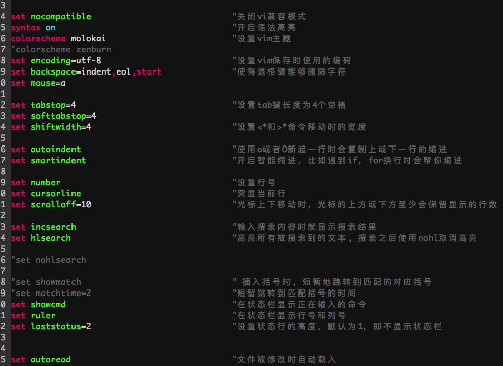
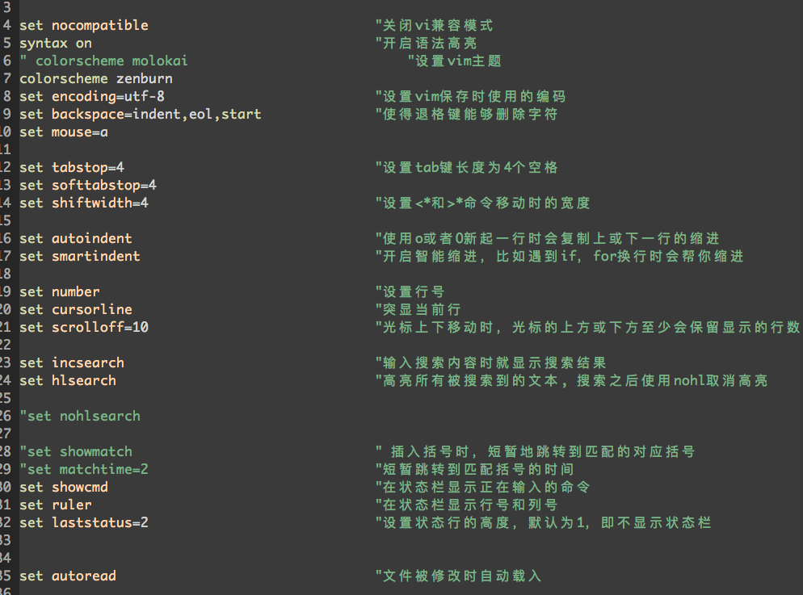

# dream-vim


## 截图
- - -
molokai主题


zenburn主题


dream主题

## 安装步骤
- - -
#### 1.下载到本地
```shell
git clone https://github.com/gzmviavia/dream-vim.git ~/.vim
```

#### 2.安装依赖项

#### 3.安装
```shell
cd ~/.vim
sudo python setup.py
```
## 目录结构
- - -
bundle : 插件管理器， 所以的插件都在该目录下

colors : vim主题， 可以在vimrc中使用colorscheme 主题名来切换主题

config : 目录下是比较复杂的配置以及各种插件的配置

templates : 是各种模板文件， 当新建相应的文件时，会拷贝模板文件的内容作为新文件的内容

vimrc : 为基础的配置

setpy.py : 安装文件

## 使用

普通模式：<F3>可以打开和关闭目录树插件

普通模式：<F4>可以打开和关闭taglist插件

普通模式：退格键可以快速注释/反注释一行

可视模式：可以选中多行，然后使用退格键批量注释/反注释

普通模式：ff可以快速往后查找一个字符，然后根据提示进行跳转

普通模式：FF可以快速往前查找一个字符，然后根据提示进行跳转

普通模式：/可以搜索多个字符，然后根据提示进行跳转


普通模式：<F5>可以根据文件名后缀的不同，执行cpp、python代码，具体见config/mapping.vim


